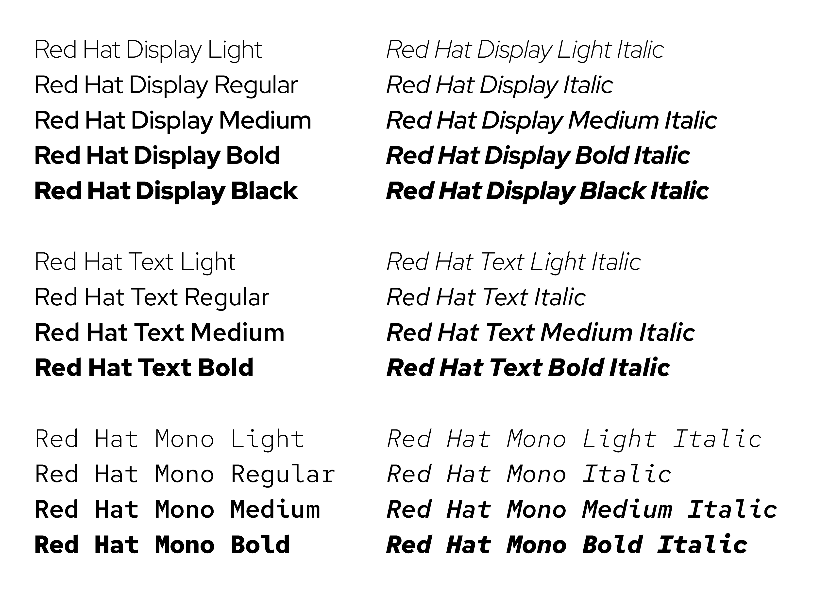
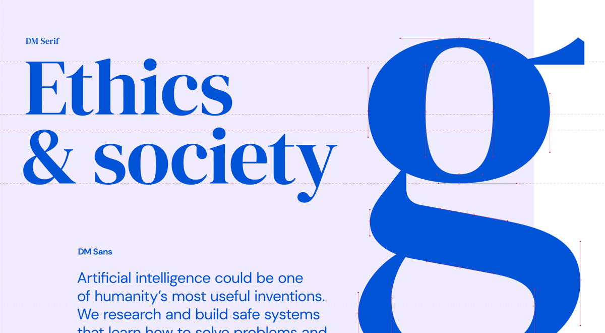
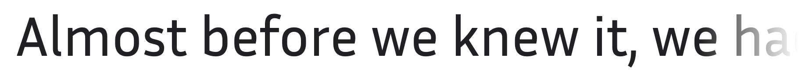

Certaines fontes offrent à la fois des versions serif, sans serif, slab, ou mono : on peut dès lors parler de "superfamilles" (*superfamily*). 

[Lire la définition de *Superfamily*](https://fonts.google.com/knowledge/glossary/superfamily) dans le glossaire de Google Fonts.

***

### Source

Superfamille constituée de :  

- **Source Code Pro** - par Paul D. Hunt pour Adobe, 2010
- **Source Sans Pro**  - par Paul D. Hunt, pour Adobe, 2012
- **Source Serif Pro** - par Frank Grießhammer pour Adobe

### Roboto

par Christian Robertson pour Google, 2011  
[sur Google Fonts](https://fonts.google.com/specimen/Roboto) / 
[sur Github](https://github.com/googlefonts/roboto)

La famille Roboto s'est étendue en 2013 avec [Roboto Slab](https://fonts.google.com/specimen/Roboto+Slab), puis en 2015 avec [Roboto Mono](https://fonts.google.com/specimen/Roboto+Mono).

En février 2022 est publié [Roboto Serif](https://material.io/blog/roboto-serif) ("a minimal workhorse for comfortable reading"). 

En mai 2022 est publié [Roboto Flex](https://material.io/blog/roboto-flex), une version de Roboto en Variable Font, dotée de 12 axes.

### IBM Plex

par Mike Abbink pour IBM, 2017  
Superfamille constituée de : 

- IBM Plex Sans
- IBM Plex Serif
- IBM Plex Mono

[Site officiel](https://www.ibm.com/plex/) / 
[sur Github](https://github.com/IBM/plex) / 
[sur Google Fonts](https://fonts.google.com/specimen/IBM+Plex+Sans)

### Red Hat Fonts

Red Hat Text  
Red Hat Display  
Red Hat Mono

[Site de démonstration](https://mckltype.com/red-hat) / 
[Red Hat fonts sur Github](https://github.com/RedHatOfficial/RedHatFont) / [Ret Hat fonts sur Google Fonts](https://fonts.google.com/?query=Red+Hat)

### DM Fonts

DM Sans  
DM Serif Text  
DM Serif Display  
DM Mono

[DM Sans sur Github](https://github.com/googlefonts/dm-fonts) / 
[DM Fonts sur Google Fonts](https://fonts.google.com/?query=Colophon+Foundry)

Les DM Fonts ont été développées pour [l'identité de l'entreprise DeepMind](https://multiadaptor.com/work/deepmind/).

### Iosevka

Iosevka  
Iosevka Slab  
Iosevka Aile  
Iosevka Etoile

[site de démonstration](https://typeof.net/Iosevka/) / 
[sur Github](https://github.com/be5invis/Iosevka) 

### Merriweather

Merriweather  
Merriweather Serif

### Inria

Fonte créée par BlackFoundry pour Inria (Institut national de recherche en sciences et technologies du numérique).

[sur BlackFoundry](https://black-foundry.com/work/inria-2/) /
[sur Github](https://github.com/BlackFoundryCom/InriaFonts) /
[sur Google Fonts](https://fonts.google.com/specimen/Inria+Sans)

### Recursive

Recursive Sans  
Recursive Mono

Une "Variable Font" dotée de 5 axes variables, qui combine des styles Sans et Mono, et offre des variantes (Casual, Weight, Slant, and Cursive).  
[site dédié](https://www.recursive.design/) / 
[sur Github](https://github.com/arrowtype/recursive) / 
[sur Google Fonts](https://fonts.google.com/specimen/Recursive)

