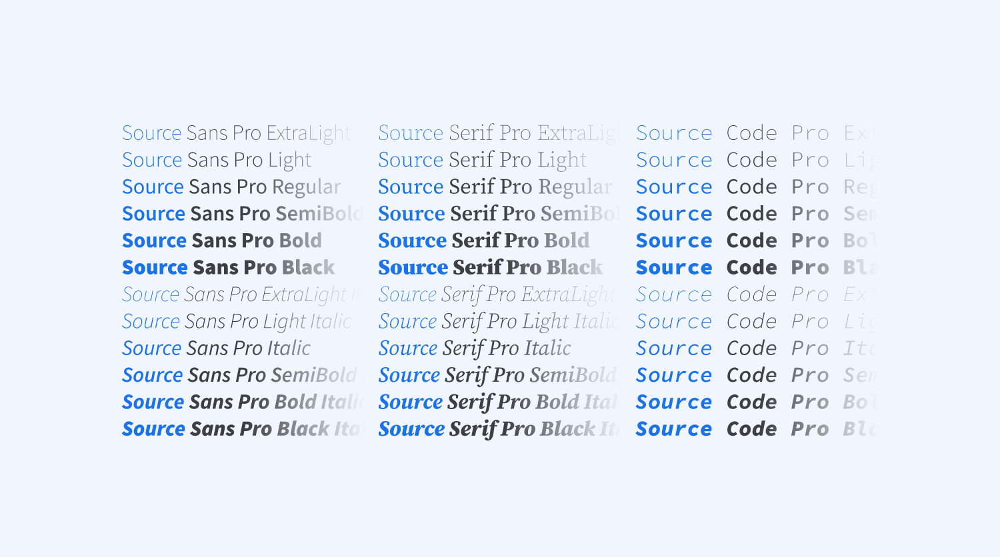
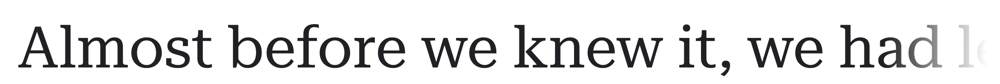
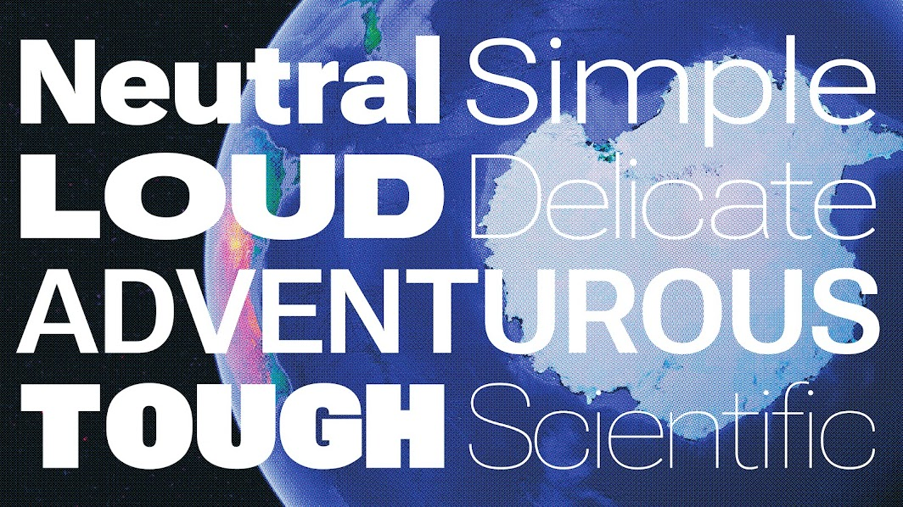

Certaines fontes offrent à la fois des versions serif, sans serif, slab, ou mono : on peut dès lors parler de "superfamilles" (*superfamily*). 

[Lire la définition de *Superfamily*](https://fonts.google.com/knowledge/glossary/superfamily) dans le glossaire de Google Fonts.

***

### Source

Superfamille constituée de :  

- **Source Code Pro** - par Paul D. Hunt pour Adobe, 2010
- **Source Sans Pro**  - par Paul D. Hunt, pour Adobe, 2012
- **Source Serif Pro** - par Frank Grießhammer pour Adobe

### Roboto

par Christian Robertson pour Google, 2011  
[sur Google Fonts](https://fonts.google.com/specimen/Roboto) / 
[sur Github](https://github.com/googlefonts/roboto)

La famille Roboto s'est étendue en 2013 avec [Roboto Slab](https://fonts.google.com/specimen/Roboto+Slab), puis en 2015 avec [Roboto Mono](https://fonts.google.com/specimen/Roboto+Mono).

En février 2022 est publié [Roboto Serif](https://material.io/blog/roboto-serif) ("a minimal workhorse for comfortable reading"). 

En mai 2022 est publié [Roboto Flex](https://material.io/blog/roboto-flex), une version de Roboto en Variable Font, dotée de 12 axes.

### IBM Plex

par Mike Abbink pour IBM, 2017  
Superfamille constituée de : 

- IBM Plex Sans
- IBM Plex Serif
- IBM Plex Mono

[Site officiel](https://www.ibm.com/plex/) / 
[sur Github](https://github.com/IBM/plex) / 
[sur Google Fonts](https://fonts.google.com/specimen/IBM+Plex+Sans)

