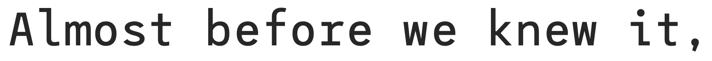

Ce document présente des propositions pour une collection de fontes open-source pouvant être utilisées dans le cursus Eracom IMD.

## Fontes Mono

**Source Code Pro**   
monospaced sans serif typeface created by Paul D. Hunt for Adobe Systems. 

**iA-Fonts**   
(based on IBM Plex)  
Source: https://github.com/iaolo/iA-Fonts  
Lire: https://ia.net/writer/blog/a-typographic-christmas 

**Inconsolata** 

**Cascadia Code**  
Commissioned by Microsoft 
https://github.com/microsoft/cascadia-code/ 
"Cascadia is a fun new coding font that comes bundled with Windows Terminal, and is now the default font in Visual Studio as well" 

**Roboto Mono**  
Dans la famille Roboto de Google

**JetBrains Mono**  
pour la société éditrice de logiciels JetBrains  
[sur Github](https://github.com/JetBrains/JetBrainsMono) / 
[sur Google Fonts](https://fonts.google.com/specimen/JetBrains+Mono) 

**League Mono**  

**Trispace**  
Version de League Mono modifiée, en Variable Font: 

[site de démonstration](https://www.etceteratype.co/trispace) / [sur Google Fonts](https://fonts.google.com/specimen/Trispace)

**Linux Libertine Mono** 

**Luxi Mono** 

**Iosevka**  
https://typeof.net/Iosevka/  
https://github.com/be5invis/Iosevka 

**Space Mono**  
Par Colophon Foundry  
[sur Google Fonts](https://fonts.google.com/specimen/Space+Mono) / 
[site de démo](https://www.colophon-foundry.org/custom/spacemono/) / 
[article sur la recherche](https://medium.com/google-design/introducing-space-mono-a-new-monospaced-typeface-by-colophon-foundry-for-google-fonts-84367eac6dfb)

**Drafting Mono**  
par Owen Earl, indestructible type  
[sur Github](https://github.com/indestructible-type/Drafting) /
[site de démo](https://indestructibletype.com/Drafting/)

