Ce document présente des propositions pour une collection de fontes open-source pouvant être utilisées dans le cursus Eracom IMD.

## Fontes Mono

### 10 fontes mono-espacées à connaître

**1) Source Code Pro**   
by Paul D. Hunt for Adobe Systems, 2010-2019.  
[sur Github](https://github.com/adobe-fonts/source-code-pro) / 
[sur Google Fonts](https://fonts.google.com/specimen/Source+Code+Pro)

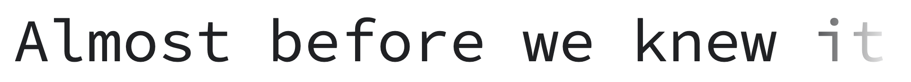

***

**2) iA-Fonts**   
Variante de IBM Plex Mono, pour le logiciel iA Writer, 2018.    
[sur Github](https://github.com/iaolo/iA-Fonts) / 
[article explicatif](https://ia.net/writer/blog/a-typographic-christmas) 

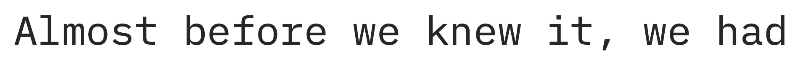

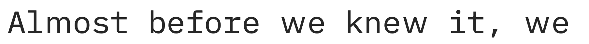

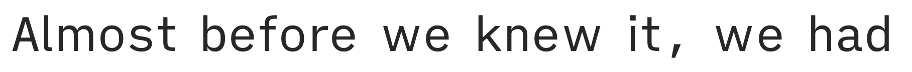

***

### 3) Recursive

**Recursive Sans & Mono**  
par Arrow Type, Stephen Nixon, 2020  
Une "Variable Font" dotée de 5 axes variables, qui combine des styles Sans et Mono, et offre des variantes (Casual, Weight, Slant, and Cursive).  
[site dédié](https://www.recursive.design/) / 
[sur Github](https://github.com/arrowtype/recursive) / 
[sur Google Fonts](https://fonts.google.com/specimen/Recursive)

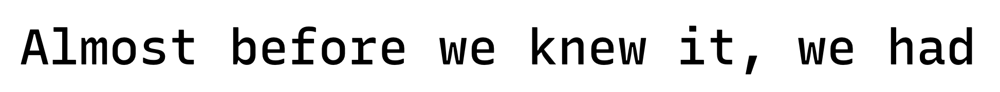

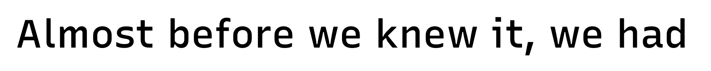

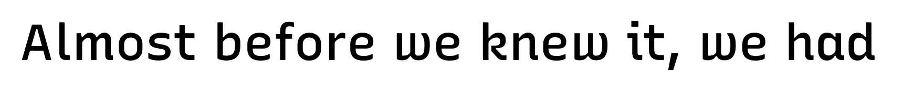

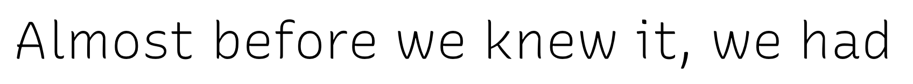

***

**4) Cascadia Code**  
par Aaron Bell, pour Microsoft, 2019   
"Cascadia is a fun new coding font that comes bundled with Windows Terminal, and is now the default font in Visual Studio as well"  
[sur Github](https://github.com/microsoft/cascadia-code/)

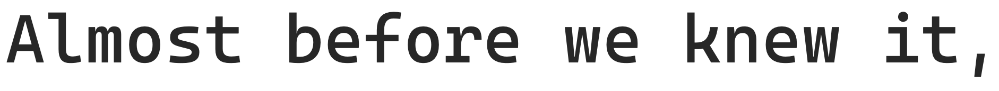

***

**5) Roboto Mono**  
Dans la famille Roboto de Google

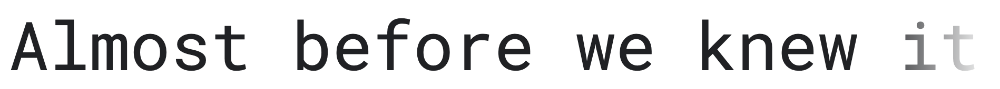

***

**6) JetBrains Mono**  
pour la société éditrice de logiciels JetBrains, 2020  
[sur Github](https://github.com/JetBrains/JetBrainsMono) / 
[sur Google Fonts](https://fonts.google.com/specimen/JetBrains+Mono) / 
[page de démonstration](https://www.jetbrains.com/lp/mono/)

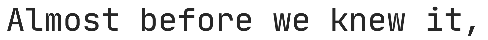

***

**7) Space Mono**  
Par Colophon Foundry, 2016  
[sur Google Fonts](https://fonts.google.com/specimen/Space+Mono) / 
[site de démo](https://www.colophon-foundry.org/custom/spacemono/) / 
[article sur la recherche](https://medium.com/google-design/introducing-space-mono-a-new-monospaced-typeface-by-colophon-foundry-for-google-fonts-84367eac6dfb)

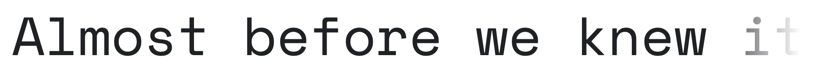

***

**8) Inconsolata**  
par Raph Levien, 2006  
[sur Github](https://github.com/googlefonts/inconsolata) / 
[sur Google Fonts](https://fonts.google.com/specimen/Inconsolata)

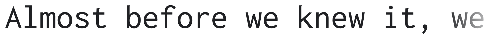

***

**9) Trispace**  
par Tyler Finck, 2020  
Version de League Mono modifiée, en Variable Font  
[site de démonstration](https://www.etceteratype.co/trispace) / 
[sur Github](https://github.com/Etcetera-Type-Co/Trispace) / 
[sur Google Fonts](https://fonts.google.com/specimen/Trispace)

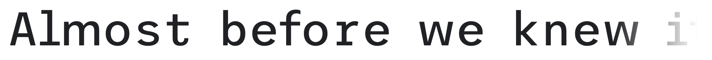

***

**10) Iosevka**  
par Renzhi Li, 2015  
[site de démonstration](https://typeof.net/Iosevka/) / 
[sur Github](https://github.com/be5invis/Iosevka) 

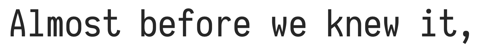

### Autres fontes mono intéressantes

**Drafting Mono**  
par Owen Earl, indestructible type, 2021  
[sur Github](https://github.com/indestructible-type/Drafting) /
[site de démo](https://indestructibletype.com/Drafting/)

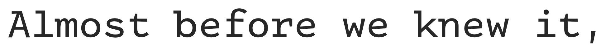

***

**Linux Libertine Mono** 

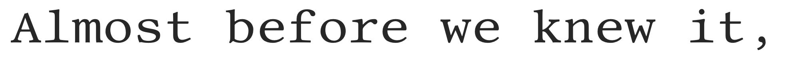

***

**Luxi Mono** 

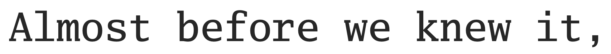

