Ce document présente des propositions pour une collection de fontes open-source pouvant être utilisées dans le cursus Eracom IMD.

## Fontes Sans Serif 

**Roboto**  
par Christian Robertson pour Google 

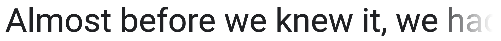

Autres fontes système de Google (pratiquement identiques):  
**Droid Sans**  
**Open Sans**  
**Noto Sans**  

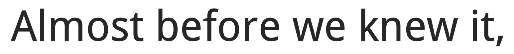

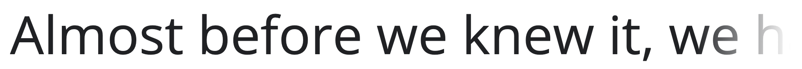

***

**IBM Plex** 

par Mike Abbink pour IBM, 2018  
Famille de fontes qui comporte trois variantes:

- IBM Plex Sans 
- IBM Plex Serif 
- IBM Plex Mono 

[Site officiel](https://www.ibm.com/plex/) / 
[sur Google Fonts](https://fonts.google.com/specimen/IBM+Plex+Sans)

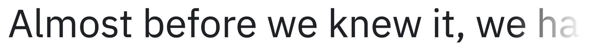

***  

**Source Sans Pro**  
Adobe's first open source typeface family, designed by Paul D. Hunt. It is a sans serif typeface intended to work well in user interfaces.

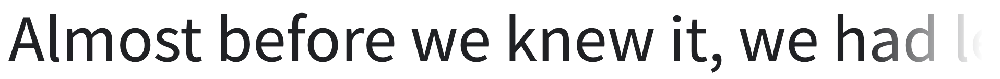

***

**Public Sans**  
A strong, neutral typeface for interfaces, text, and headings.  
Developed by the United States Web Design System.  
[Site officiel](https://public-sans.digital.gov/) / [sur Google Fonts](https://fonts.google.com/specimen/Public+Sans) 

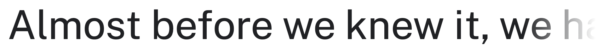

***

**Cooper Hewitt** 
par Eddie Opara (Pentagram) et Chester Jenkins (Village)   
[Site officiel](https://www.cooperhewitt.org/open-source-at-cooper-hewitt/cooper-hewitt-the-typeface-by-chester-jenkins/) 

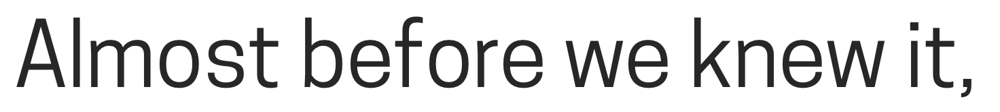

***

**Clear Sans**  
par Intel  
created and designed by Daniel Ratighan at Monotype under the direction of the User Experience team at Intel's Open Source Technology Center  
[sur Github](https://github.com/intel/clear-sans)

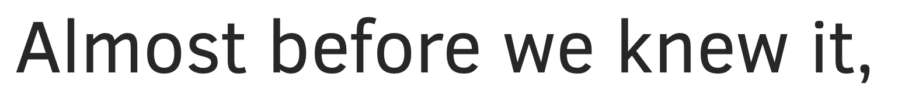

***

**Inter**  
par Rasmus Andersson   
"Inter is similar to Roboto, San Francisco, Akkurat, Asap, Lucida Grande and other "UI" and "Text" typefaces"  
[Site officiel](https://rsms.me/inter/) / 
[sur Google Fonts](https://fonts.google.com/specimen/Inter)

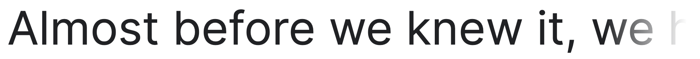

***

**Poppins**  
et **DM Sans** 

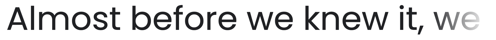

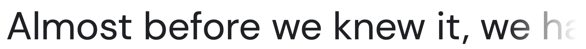

***

**Sora**  
Fonte de l'entreprise japonaise Soramitsu  
[sur Github](https://github.com/sora-xor/sora-font) /
[sur Google Fonts](https://fonts.google.com/specimen/Sora)

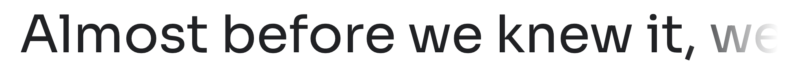

***

**Manrope**  
par Mikhail Sharanda (Design Director at Huawei)  
"Modern Geometric Sans-Serif"  
[site officiel](https://manropefont.com/) / 
[sur Google Fonts](https://fonts.google.com/specimen/Manrope)

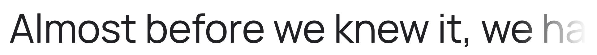

***

**Fira Sans**   
a humanist sans-serif typeface designed by Erik Spiekermann 
a slightly wider and calmer adaptation of Spiekermann's typeface Meta.  
Fira Sans is the font of choice for the New Zealand Government and the Government of Iceland. 

aussi: Fira Mono et FiraGO  
https://github.com/mozilla/Fira  
https://bboxtype.com/typefaces/FiraGO/ 

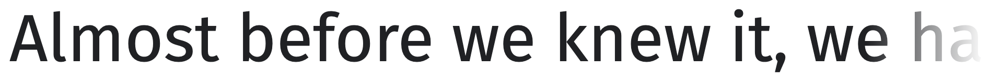

***

**Breeze Sans**   
a humanist sans-serif typeface designed by Dalton Maag for Samsung, 2013.  
interface font of the Tizen operating system and the Samsung Galaxy Watch.  
https://developer.tizen.org/design/platform/styles/typography 

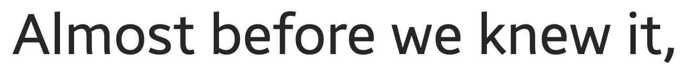

***

**Epilogue**  
par Tyler Finck, Etcetera Type Co, 2020  
[sur Google Fonts](https://fonts.google.com/specimen/Epilogue) /
[sur Github](https://github.com/Etcetera-Type-Co/Epilogue) / 
[page de démonstration](https://www.etceteratype.co/epilogue)

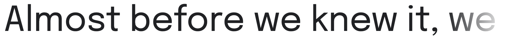

***

**HK Grotesk** 
par Alfredo Marco Pradil, Hanken Design Co, 2015  
"sans serif typeface inspired by the classic grotesques"  
[site officiel](https://hanken.co/products/hk-grotesk)
[sur Behance](https://www.behance.net/gallery/28749913/HK-Grotesk-Open-Source-Typeface)

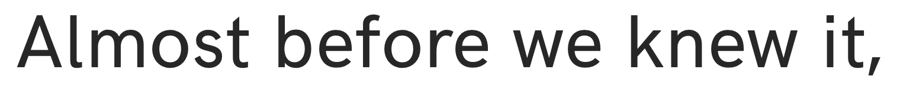

***

**Barlow** 
par Jeremy Tribby, 2017  
a slightly rounded, low-contrast, grotesk type family (variable font)  
[sur Google Fonts](https://fonts.google.com/specimen/Barlow) / 
[sur Github](https://github.com/jpt/barlow) / 
[page de démonstration](https://tribby.com/fonts/barlow/) 

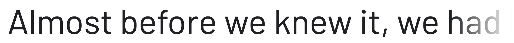

***

**Montserrat** 

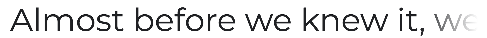

**Archivo**  
et **Chivo**

### Fontes géométriques

**Jost**
par Owen Earl, Indestructible Type, 2017-2020    
"inspired by 1920s German sans-serifs"  
[sur Google Fonts](https://fonts.google.com/specimen/Jost) / 
[page de démonstration](https://indestructibletype.com/Jost.html)

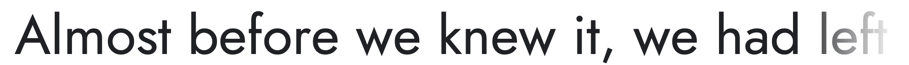
