Ce document présente des propositions pour une collection de fontes open-source pouvant être utilisées dans le cursus Eracom IMD.

## Fontes Serif

**Source Serif Pro**  
par Frank Grießhammer pour Adobe Systems  
(aussi dans cette famille: Source Sans Pro et Source Code Pro) 

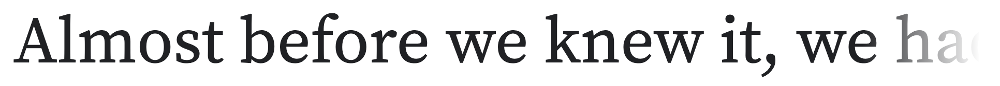

***

**Fraunces**  
by Undercase Type, 2020  
a Variable Font with four axes: Weight (wght), Optical Size (opsz), Softness (SOFT), and Wonky (WONK)  
[sur Google Fonts](https://fonts.google.com/specimen/Fraunces) / 
[sur Github](https://github.com/undercasetype/Fraunces) / 
[page de présentation](https://fraunces.undercase.xyz/)

***

**ET Book**  
"A webfont of the typeface used in Edward Tufte’s books."  
a Bembo-like font for the computer, designed by Dmitry Krasny, Bonnie Scranton, and Edward Tufte (2015).  
[sur Github](https://github.com/edwardtufte/et-book)

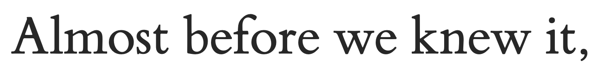

***

**Spectral**  
par Production Type, 2017  
"a new serif face for screen use"  
[sur Google Fonts](https://fonts.google.com/specimen/Spectral) / 
[page de présentation](https://www.productiontype.com/family/spectral) /
[article sur la création de Spectral](https://design.google/library/spectral-new-screen-first-typeface/)
  
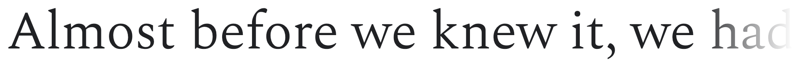

**Newsreader**  
par Production Type, 2020  
[sur Google Fonts](https://fonts.google.com/specimen/Newsreader) / 
[page de présentation](https://www.productiontype.com/family/newsreader)

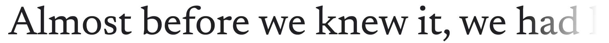

***

**Merriweather**  
par Eben Sorkin, 2016
(aussi: Merriweather Sans)  
[sur Google Fonts](https://fonts.google.com/specimen/Merriweather) /
[sur Github](https://github.com/SorkinType/Merriweather)

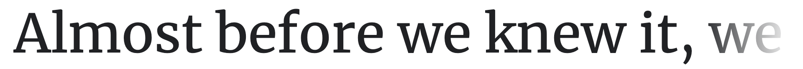

***

**Inria Serif**  
Fonte créée par BlackFoundry pour Inria (Institut national de recherche en sciences et technologies du numérique).  
Famille de fontes qui comporte aussi une variante sans-serif.  
[sur BlackFoundry](https://black-foundry.com/work/inria-2/) /
[sur Github](https://github.com/BlackFoundryCom/InriaFonts) /
[sur Google Fonts](https://fonts.google.com/specimen/Inria+Sans)

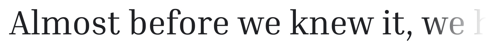

***

**IBM Plex**  
par Mike Abbink pour IBM, 2017  
Famille de fontes qui comporte aussi une Sans Serif et une mono.  
[Site officiel](https://www.ibm.com/plex/) / 
[sur Github](https://github.com/IBM/plex) / 
[sur Google Fonts](https://fonts.google.com/specimen/IBM+Plex+Sans)

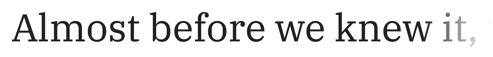

***

**Literata**  
par TypeTogether (Veronika Burian et José Scaglione).  
Fonte commissionnée par Google pour son application Google Play Books.
[sur Google Fonts](https://fonts.google.com/specimen/Literata)
[sur TypeTogether](https://www.type-together.com/literata-font)

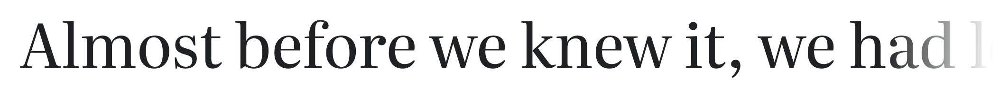

***

**Cormorant**  
by Christian Thalmann, Catharsis Fonts, 2015  
une garalde – "an extravagant display serif typeface inspired by the Garamond heritage"  
[sur Google Fonts](https://fonts.google.com/specimen/Cormorant) / 
[sur Github](https://github.com/CatharsisFonts/Cormorant/) 

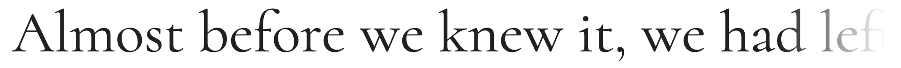

***

**EB Garamond**  
Digitization of the Garamond shown on the Egenolff-Berner specimen  
[sur Google Fonts](https://fonts.google.com/specimen/EB+Garamond) / 
[sur Github](https://github.com/georgd/EB-Garamond) 

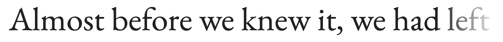

aussi:  
**RW Garamond**  
https://github.com/dbenjaminmiller/rwgaramond 

***

**Ibarra Real Nova**  
Police basée sur l'édition de *Don Quichotte* publiée  par Joaquín Ibarra en 1780.  
[sur Google Fonts](https://fonts.google.com/specimen/Ibarra+Real+Nova) / 
[sur Github](https://github.com/googlefonts/ibarrareal) 

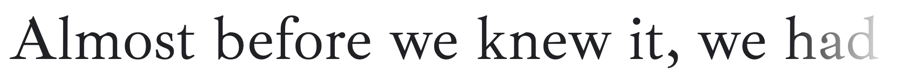

***

**Junicode**  
developed especially for medievalists  
nouvelle version: JuniusX  
[sur Github](https://psb1558.github.io/Junicode-New/) 

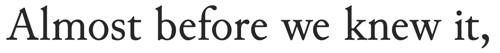

***

**Cardo**   
old-style serif font designed for academic users  
[sur Google Fonts](https://fonts.google.com/specimen/Cardo)

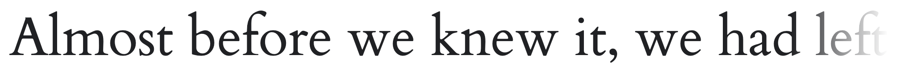

***

**Bodoni Moda**  
"a no-compromises Bodoni family, built for the digital age"  
par Owen Earl,  indestructible type, 2019-2020.  
[sur Github](https://github.com/indestructible-type/Bodoni)  
[sur Google Fonts](https://fonts.google.com/specimen/Bodoni+Moda)

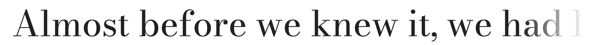

***

**Playfair Display**  
par Claus Eggers Sørensen, 2017  
[sur Github](https://github.com/clauseggers/Playfair-Display) / 
[sur Google Fonts](https://fonts.google.com/specimen/Playfair+Display)

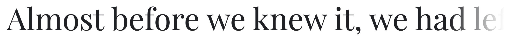

### Fontes Slab Serif (égyptiennes, mécanes)

**Zilla Slab**  
by Typotheque foundry, 2017  
used as the branding font for Mozilla Foundation  
[sur Github](https://github.com/mozilla/zilla-slab) / 
[sur Google Fonts](https://fonts.google.com/specimen/Zilla+Slab) 

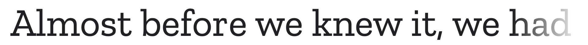

***

**Bitter**  
par Sol Matas, 2010  
[site officiel](http://www.solmatas.com/bitter) / 
[sur Google Fonts](https://fonts.google.com/specimen/Bitter)

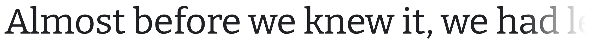

***

**Besley**  
"antique slab serif inspired by Robert Besley's Clarendon"  
par Owen Earl,  indestructible type, 2020.  
[sur Github](https://github.com/indestructible-type/Besley) / 
[sur Google Fonts](https://fonts.google.com/specimen/Besley)

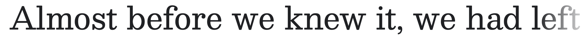

---

### Fontes serif historiques

**Gotico-Antiqua, Proto-Roman, Hybrid**  
Une collection de 15 fontes basées sur des modèles historiques (1459-1482), produites par l'Atelier national de recherche typographique:  
"Parallèlement aux recherches historiques, Rafael Ribas et Alexis Faudot, chercheurs à l’ANRT, ont produit quinze fontes et un ensemble de lettres initiales. Fondés sur une série d’ateliers menés entre 2015 et 2018 dans des écoles d’art et de design en France et en Allemagne, réunissant plus de 150 étudiants, les polices de caractères numériques sont le résultat d’une analyse approfondie et d’une refonte des originaux."  
[sur Github](https://github.com/anrt-type/GoticoAntiqua) / 
[site officiel](https://gotico-antiqua.anrt-nancy.fr/#caracteres)

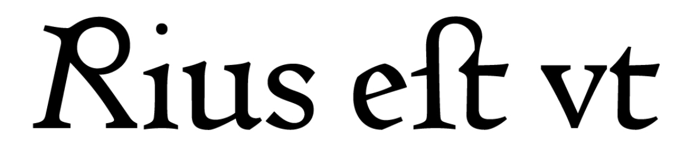